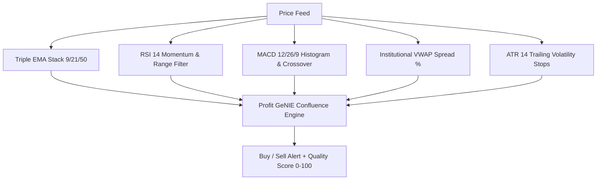

# ⚡ PROFIT GENIE — Institutional Terminal & Strategy Documentation Guide

---

## 🌟 1. Executive System Overview

**Profit GeNIE** is an institutional-grade intraday and swing trading terminal designed specifically for the **National Stock Exchange of India (NSE)**. It bridges the gap between raw algorithmic market feeds and high-conviction trade execution across equities, sectors, and derivatives (F&O Stock Options).

### Core Architectural Principles:
1. **Low-Latency Hybrid Feed**:
   - **Primary Engine**: FYERS Broker API v3 with real-time WebSocket tick streaming and 120-second token lifecycle management.
   - **Secondary Engine**: In-memory multi-threaded Yahoo Finance fallback scraper for continuous real-time quotes without downtime.
2. **Deterministic Mathematical Engines**:
   - Live Index point contribution calculation based on real-time free-float market capitalization weightages.
   - Algorithmic Strike step selector and Black-Scholes ATM Option Premium estimator.
   - 4-Quadrant Open Interest (OI) buildup classification engine.
3. **Glassmorphic Pro Trader UI**:
   - Real-time heatmaps, matrix grids, day range percentage sliders, confluence badges, and multi-factor setup scoring ($0 - 100$).

---

## 🧭 2. Header & Real-Time Market Pulse Strip

Located at the top of the terminal, the **Market Pulse Strip** synchronizes with real-time exchange data to provide an immediate market health check.

| Metric | Calculation / Source | Institutional Meaning |
| :--- | :--- | :--- |
| **Market Status** | NSE Market Hours (09:15 AM – 03:30 PM IST) | `Market Live` (Green pulse) vs `Market Closed` (Gray). |
| **NIFTY 50 Index** | Live LTP, Net Change ($\Delta$), % Change ($\Delta\%$) | Exact lockstep synchronization with Nifty 50 constituent contribution engine. |
| **BANK NIFTY Index** | Live LTP, Net Change ($\Delta$), % Change ($\Delta\%$) | Exact lockstep synchronization with 12 Bank Nifty banking constituents. |
| **Top Sector Banner** | Maximum % change among 14 tracked NSE Sector Indices | Highlights the primary sector driving capital flows (e.g., `Consumer Durables (+0.98%)`). |
| **Auto-Refresh Engine** | Configurable polling interval ($5\text{s}$, $10\text{s}$, $30\text{s}$, $60\text{s}$) | Asynchronous data refresh with rotating sync animations. |

---

## 📈 3. Tab 1: Nifty 50 Movers & Draggers

### Objective:
Identify the exact institutional heavyweights driving the Nifty 50 index upward (**Movers**) or pulling it downward (**Draggers**).

### 📐 Mathematical Formulation:
The Point Contribution ($\Delta \text{Pts}_i$) of constituent $i$ is calculated as:
$$\Delta \text{Pts}_i = \left( \frac{\text{Weightage}_i (\%)} {100} \right) \times \left( \frac{\Delta P_i (\%)} {100} \right) \times \text{Nifty Base Index}$$

Where:
- $\text{Weightage}_i$: Official free-float weightage of stock $i$ in Nifty 50 (e.g., HDFCBANK $\approx 13.5\%$, RELIANCE $\approx 9.8\%$, ICICIBANK $\approx 7.9\%$, INFY $\approx 5.8\%$, etc.).
- $\Delta P_i$: Real-time percentage price change of stock $i$ from previous day's close.
- $\text{Nifty Base Index}$: Baseline reference price of the index.

### 🎨 Visual Views:
1. **Treemap Heatmap**: Proportional tile sizing based on weightage; color intensity scaled from Deep Green ($+4.0\text{ pts}$) to Deep Red ($-4.0\text{ pts}$).
2. **Matrix Grid**: Compact stock cards showcasing Point Impact, % Change, Day Range %, and VWAP status.
3. **Data Table**: High-density sortable list with TradingView charting links.

### 🔍 Interactive Tooltips:
Hovering over any stock tile displays:
- **Point Contribution**: Exact points added or deducted from Nifty 50.
- **LTP & % Change**: Live quote and percentage movement.
- **Day High / Low Spread**: Intraday range boundaries.
- **VWAP Delta**: Price spread relative to Volume Weighted Average Price.
- **Turnover in ₹ Cr**: Institutional volume liquidity.

---

## 🏦 4. Tab 2: Bank Stocks (Bank Nifty Screener)

### Objective:
Dedicated intelligence for the 12 core banking stocks comprising the **Nifty Bank Index**.

### 🏛️ Constituent Universe & Segregation:
- **Private Sector Banks**: `HDFCBANK`, `ICICIBANK`, `KOTAKBANK`, `AXISBANK`, `INDUSINDBK`, `FEDERALBNK`, `IDFCFIRSTB`, `BANDHANBNK`, `AUBANK`.
- **Public Sector (PSU) Banks**: `SBIN`, `PNB`, `BANKBARODA`.

### ⚡ Key Features:
- Filter pills to isolate **Private Banks** vs **PSU Banks**.
- Point impact and percentage price gain toggles.
- Real-time spread from day's VWAP to detect institutional banking breakout candidates.

---

## 📊 5. Tab 3: Sector Performance & Intelligence Screener

### Objective:
Track sector rotation, capital inflow/outflow, and identify leading momentum stocks inside each sector.

### 🏢 14 Tracked NSE Sectors:
1. **Nifty IT** (`TCS`, `INFY`, `HCLTECH`, `WIPRO`, `TECHM`, `LTIM`, `COFORGE`, `MPHASIS`, `PERSISTENT`)
2. **Nifty Bank** (`HDFCBANK`, `ICICIBANK`, `SBIN`, `AXISBANK`, `KOTAKBANK`, `PNB`)
3. **Nifty Auto** (`TATAMOTORS`, `M&M`, `MARUTI`, `BAJAJ-AUTO`, `HEROMOTOCO`, `EICHERMOT`, `TVSMOTOR`)
4. **Nifty Metal** (`TATASTEEL`, `JSWSTEEL`, `HINDALCO`, `VEDL`, `JINDALSTEL`, `NMDC`, `NATIONALUM`)
5. **Nifty Pharma** (`SUNPHARMA`, `DRREDDY`, `CIPLA`, `DIVISLAB`, `LUPIN`, `AUROPHARMA`, `BIOCON`)
6. **Nifty FMCG** (`ITC`, `HINDUNILVR`, `NESTLEIND`, `BRITANNIA`, `TATACONSUM`, `DABUR`, `MARICO`)
7. **Nifty Energy** (`RELIANCE`, `ONGC`, `NTPC`, `POWERGRID`, `BPCL`, `IOC`, `COALINDIA`, `GAIL`)
8. **Nifty Financial Services** (`BAJFINANCE`, `BAJAJFINSV`, `CHOLAFIN`, `MUTHOOTFIN`, `SHRIRAMFIN`, `PFC`, `RECLTD`)
9. **Nifty Realty** (`DLF`, `GODREJPROP`, `OBEROIRLTY`, `PHOENIXLTD`, `BRIGADE`, `PRESTIGE`)
10. **Nifty Media** (`ZEEL`, `SUNTV`, `PVRINOX`, `SAREGAMA`, `NETWORK18`)
11. **Nifty Healthcare** (`APOLLOHOSP`, `MAXHEALTH`, `FORTIS`, `MEDANTA`, `LALPATHLAB`)
12. **Nifty Consumer Durables** (`TITAN`, `HAVELLS`, `VOLTAS`, `DIXON`, `CROMPTON`, `WHIRLPOOL`, `POLYCAB`)
13. **Nifty Oil & Gas** (`PETRONET`, `IGL`, `MGL`, `GUJGASLTD`, `OIL`, `HINDPETRO`)
14. **Nifty PSU Bank** (`SBIN`, `PNB`, `BANKBARODA`, `CANBK`, `UNIONBANK`, `INDIANB`)

### 🔬 Sector Intelligence Drilldown Modal:
Clicking any sector card launches the **Sector Intelligence Screener**:
- **Live Sector Header**: Index level, Breadth (Advances/Declines), and Sector Turnover in ₹ Cr.
- **🔥 Pro Trader Hot Picks**: Automatically spotlights stocks with Institutional Potential Score $\ge 65$.
- **⚡ Batch Scanner Universe Injection**: One-click button (`+ Add Top 5 Leaders to Scanner`) to instantly inject the strongest momentum stocks into the live scanner.
- **Multi-Factor Stock Setup Badges**:
  - `👑 Sector Alpha Leader`: Outperforming parent sector index by $>0.8\%$.
  - `🚀 Day High Breakout`: Trading in the top $15\%$ of day's range.
  - `⚡ Above VWAP`: Institutional buying support above VWAP.
  - `🌊 High Volume`: Significant liquidity and turnover.

---

## ⚡ 6. Tab 4: Profit GeNIE Signals Board (Pine Script Engine)

### Objective:
Real-time institutional trade alerts generated from multi-indicator confluence.

### 📊 Algorithmic Technical Indicators Used:

1. **Triple EMA Trend Filter**:
   - Fast: **EMA 9**, Medium: **EMA 21**, Baseline: **EMA 50**.
   - Bullish Alignment: $\text{Price} > \text{EMA}_9 > \text{EMA}_{21} > \text{EMA}_{50}$.
   - Bearish Alignment: $\text{Price} < \text{EMA}_9 < \text{EMA}_{21} < \text{EMA}_{50}$.
2. **RSI (14) Momentum Oscillator**:
   - Bullish Regime: $\text{RSI} > 50$ (Bullish expansion, non-overbought $< 75$).
   - Bearish Regime: $\text{RSI} < 50$ (Bearish breakdown, non-oversold $> 25$).
3. **MACD (12, 26, 9) Histogram Divergence**:
   - Signal trigger on MACD line crossing Signal line with expanding histogram bars.
4. **Institutional VWAP & VWAP Spread**:
   $$\text{VWAP Spread (\%)} = \left( \frac{\text{LTP} - \text{VWAP}}{\text{VWAP}} \right) \times 100$$
   - Green setup: Price above VWAP ($\text{Spread} > 0\%$).
   - Red setup: Price below VWAP ($\text{Spread} < 0\%$).
5. **ATR (14) Volatility Trailing Targets**:
   - Long Target: $\text{LTP} + (1.5 \times \text{ATR}_{14})$; Stop Loss: $\text{LTP} - (1.0 \times \text{ATR}_{14})$.
   - Short Target: $\text{LTP} - (1.5 \times \text{ATR}_{14})$; Stop Loss: $\text{LTP} + (1.0 \times \text{ATR}_{14})$.

### 🏆 Profit GeNIE Setup Score ($0 - 100$):
- **Day Range Dominance ($0 - 35\text{ pts}$)**: Proximity to Day High (for buys) or Day Low (for sells).
- **Price Momentum Delta ($0 - 25\text{ pts}$)**: Magnitude and velocity of price move.
- **VWAP Support / Rejection ($0 - 25\text{ pts}$)**: Price acceptance on institutional side of VWAP.
- **Turnover & Liquidity ($0 - 15\text{ pts}$)**: Volume and turnover scaling.

---

## 🎯 7. Tab 5: Option Scout (Derivatives Genie)

### Objective:
Identify high-probability **Options (CE & PE)** buying opportunities across both **Major Benchmark Indices / MCX Commodities** and **131 Liquid F&O Stocks** with real-time ATM strike selection, Greeks simulation, and Open Interest analysis.

---

### 🏛️ 1. Major Indices & MCX Commodities Command Center
Traders can seamlessly toggle between major index/commodity benchmarks and individual F&O stock options using the **Asset Class Switcher**:

| Instrument | Asset Class | Strike Interval ($\Delta K$) | Official Contract Lot Size | TradingView Live Feed |
| :--- | :--- | :--- | :--- | :--- |
| **NIFTY 50** (`NIFTY`) | NSE Benchmark Index | $₹50$ | $25$ shares | `NSE:NIFTY` |
| **BANK NIFTY** (`BANKNIFTY`) | NSE Banking Benchmark | $₹100$ | $15$ shares | `NSE:BANKNIFTY` |
| **BSE SENSEX** (`SENSEX`) | BSE Benchmark Index | $₹100$ | $10$ shares | `BSE:SENSEX` |
| **MCX CRUDE OIL** (`CRUDEOIL`) | MCX Energy Commodity | $₹50$ | $100$ Barrels (Standard) | `MCX:CRUDEOIL1!` |
| **MCX CRUDE OIL MINI** (`CRUDEOILM`) | MCX Energy Mini | $₹50$ | $10$ Barrels (Retail Mini) | `MCX:CRUDEOILM1!` |

#### Key Benefits of Major Index & MCX Recommendations:
- **Instant Capital Requirement**: Clearly computes whether an option setup requires institutional capital (e.g. Nifty $₹7,300$) or minimal retail capital (e.g. Crude Oil Mini $₹1,950$).
- **Direct TradingView Deep Link**: One-click button launches the exact TV chart with the active ticker.
- **Dedicated Asset Badges**: Highlights whether an asset is a `👑 Benchmark Index` or `🛢️ MCX Commodity`.

---

### 🔢 2. Dynamic Strike Step Selector
To prevent invalid strike prices, the strike interval automatically adapts to stock price tiers:
| Stock Price Tier | Strike Step Interval ($\Delta K$) | Example |
| :--- | :--- | :--- |
| $\text{Price} \ge ₹10,000$ | $₹200$ | MRF $₹1,35,000 \to 135200\text{ CE}$ |
| $₹5,000 \le \text{Price} < ₹10,000$ | $₹100$ | MARUTI $₹12,400 \to 12400\text{ CE}$ |
| $₹2,500 \le \text{Price} < ₹5,000$ | $₹50$ | TITAN $₹3,458 \to 3450\text{ CE}$ |
| $₹1,000 \le \text{Price} < ₹2,500$ | $₹20$ | RELIANCE $₹1,258 \to 1260\text{ CE}$ |
| $₹500 \le \text{Price} < ₹1,000$ | $₹10$ | SBIN $₹820 \to 820\text{ CE}$ |
| $₹200 \le \text{Price} < ₹500$ | $₹5$ | BHEL $₹428 \to 430\text{ PE}$ |
| $\text{Price} < ₹200$ | $₹2.50$ | WIPRO $₹177 \to 177.5\text{ PE}$ |

$$\text{ATM Strike } (K) = \text{round}\left(\frac{\text{LTP}}{\Delta K}\right) \times \Delta K$$

---

### 📉 3. Black-Scholes ATM Premium & Capital Model
Estimated ATM option premium is computed based on Implied Volatility (IV) and Spot Price:
$$\text{Est. Premium} = \text{LTP} \times \left( 0.015 + \frac{\text{IV}}{1500} \right)$$

$$\text{Required Capital per Lot} = \text{Est. Premium} \times \text{Official Lot Size}$$

$$\text{Breakeven (CE)} = K + \text{Est. Premium} \quad \Big| \quad \text{Breakeven (PE)} = K - \text{Est. Premium}$$

---

### 📊 4. Open Interest (OI) 4-Quadrant Buildup Matrix
The terminal continuously evaluates price and derivative volume action to classify the institutional positioning regime:

| Price Action | Open Interest (OI) | Classification | Signal & Setup Badge | Institutional Interpretation |
| :---: | :---: | :---: | :---: | :--- |
| **Rising ($\uparrow$)** | **Rising ($\uparrow$)** | **Long Buildup** | `🚀 Long Buildup (+OI%)` | Aggressive institutional buyers taking fresh long option positions. |
| **Rising ($\uparrow$)** | **Falling ($\downarrow$)** | **Short Covering** | `💥 Short Covering Squeeze` | Trapped short sellers panic-buying back contracts; explosive quick upmove. |
| **Falling ($\downarrow$)** | **Rising ($\uparrow$)** | **Short Buildup** | `🩸 Short Buildup (+OI%)` | Aggressive institutional short sellers creating fresh bearish positions. |
| **Falling ($\downarrow$)** | **Falling ($\downarrow$)** | **Long Unwinding** | `⚠️ Long Unwinding (-OI%)` | Discouraged buyers dumping long positions; momentum fading. |

---

### 🛡️ 5. Implied Volatility Rank (IVR) & Put-Call Ratio (PCR)
- **IV Rank ($\text{IVR} \le 40$)**: Tagged with `🔥 Low IV Entry` — Indicates underpriced options ideal for net option buyers (minimal time decay volatility penalty).
- **IV Rank ($\text{IVR} \ge 75$)**: Tagged with `⚡ High IV Warning` — Volatility is expensive; indicates wider swings or post-earnings crush risks.
- **Bullish PCR ($\text{PCR} \ge 1.25$)**: Tagged with `🛡️ Bullish PCR` — High put writing support.
- **Bearish PCR ($\text{PCR} \le 0.65$)**: Tagged with `🔻 Bearish PCR` — Heavy call writing resistance.

---

### 🕒 6. Real-Time Signal Timestamps
Every Option setup carries an explicit timestamp:
- **Cards View**: Displayed in the top pill (`🕒 02:58 PM`) and in the footer (`🕒 27 Aug, 02:58:15 PM`).
- **Table View**: Displayed in the **F&O STOCK & TIME** column.
- **Sorting**: Includes **Sort by Signal / Call Time** to instantly review the newest market alerts.

---

## ⚙️ 8. Tab 6: Scanner & Universe Engine

### Objective:
Background multi-symbol scanner daemon running every 60 seconds with FYERS broker authorization management and custom symbol universe editing.

### 🔐 FYERS OAuth Token Lifecycle:
1. User clicks **`1. Open FYERS Login`** to generate an authorization code on the official FYERS API portal.
2. User pastes the redirect URL or authorization code into the **Profit GeNIE Token Manager**.
3. The server exchanges the code with FYERS for an access token (valid for trading day) and switches the primary data feed to live tick streaming.

### 📋 Custom Universe Manager:
- Edit, append, or replace monitored stocks directly in the universe textarea.
- Instant universe size indicator and last scan candle time diagnostics.

---

## 📚 9. Summary Indicator Matrix & Trader Cheat Sheet

| Indicator / Metric | Period / Setting | Bullish Trigger Condition | Bearish Trigger Condition | Purpose |
| :--- | :--- | :--- | :--- | :--- |
| **VWAP** | Daily Volume Weighted | $\text{LTP} > \text{VWAP}$ ($+0.3\%$ spread) | $\text{LTP} < \text{VWAP}$ ($-0.3\%$ spread) | Institutional benchmark & intraday trend filter. |
| **EMA Stack** | 9, 21, 50 | $\text{EMA}_9 > \text{EMA}_{21} > \text{EMA}_{50}$ | $\text{EMA}_9 < \text{EMA}_{21} < \text{EMA}_{50}$ | Trend direction and dynamic support/resistance. |
| **RSI** | 14 periods | $\text{RSI} > 50$ (expanding towards $70$) | $\text{RSI} < 50$ (declining towards $30$) | Momentum velocity and exhaustion indicator. |
| **MACD** | 12, 26, 9 | Line above Signal; Green Histogram | Line below Signal; Red Histogram | Trend acceleration & momentum divergence. |
| **Day Range %** | Daily High - Low | $\text{Day Range} \ge 75\%$ | $\text{Day Range} \le 25\%$ | Identifies breakout leaders vs breakdown laggards. |
| **OI Buildup** | Intraday Derivative OI | Long Buildup or Short Covering | Short Buildup or Long Unwinding | Institutional positioning and squeeze direction. |
| **IV Rank (IVR)** | Daily IV range ($0-100$) | $\text{IVR} \le 40$ (Low IV Entry) | $\text{IVR} \le 40$ (Low IV Entry) | Gauges option premium pricing for option buyers. |
| **PCR** | Total Put OI / Call OI | $\text{PCR} \ge 1.20$ | $\text{PCR} \le 0.70$ | Market sentiment and institutional hedging bias. |

---

## 🎯 10. Pro Trader Execution Playbook

1. **Top-Down Confluence Check**:
   - Check **Global Pulse Strip** $\to$ Confirm if Nifty 50 and Bank Nifty are advancing or declining.
   - Check **Sector Performance** $\to$ Identify the top gaining sector of the morning.
2. **Setup Selection in Option Scout**:
   - Switch to **Option Scout** $\to$ Filter by `Score 80+` or `Low IV Entry`.
   - Verify that the stock has `🚀 Long Buildup` and is trading `⚡ Above VWAP`.
3. **Execution & Risk Management**:
   - Check **Recommended ATM Strike** and verify **Required Capital per Lot**.
   - Click `📈 Spot TV ↗` to view the live TradingView chart.
   - Set Stop Loss at VWAP or $1.0 \times \text{ATR}$ and Target at Breakeven / Day High extension.
